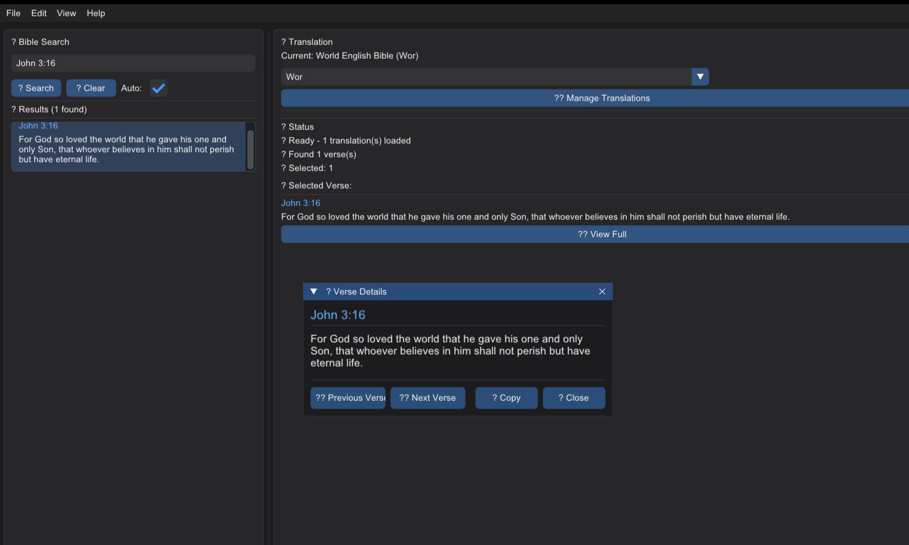

# VerseFinder

VerseFinder is a high-performance, cross-platform C++ GUI application designed for churches to quickly retrieve and display Bible verses during services. Built with modern C++20, Dear ImGui, and OpenGL, it provides sub-second search times and supports multiple Bible translations with an intuitive interface.



## ✨ Key Features

### 📖 Search Capabilities
- **Reference Search**: Direct verse lookup (e.g., "John 3:16", "Romans 8:28")
- **Keyword Search**: Find verses by content phrases (e.g., "for God so loved the world")
- **Live Search**: Results update as you type for instant feedback
- **Intelligent Highlighting**: Matched keywords are highlighted in search results

### 🔄 Translation Management
- **Multi-Translation Support**: Load and switch between different Bible translations
- **Auto-Download System**: Download new translations directly from the application
- **Persistent Storage**: Translations saved to local files for offline use
- **Translation Switching**: Seamlessly switch between loaded translations

### 🎯 User Interface
- **Modern GUI**: Clean, professional interface built with Dear ImGui
- **Expanded Modal Views**: Large, readable verse display windows (900x650px)
- **Verse Navigation**: Next/Previous verse buttons for easy browsing
- **Responsive Design**: Adapts to different screen sizes and resolutions
- **Keyboard Shortcuts**: Efficient navigation with keyboard support

### ⚡ Performance
- **In-Memory Storage**: All Bible data loaded into memory for instant access
- **Optimized Indexing**: Advanced keyword indexing for fast search operations
- **Asynchronous Loading**: Non-blocking translation loading and downloads
- **Cross-Platform**: Runs on Windows, macOS, and Linux

## 🔧 Technical Requirements

### Minimum Requirements
- **Operating System**: Windows 10+, macOS 10.14+, or Linux (Ubuntu 18.04+)
- **Compiler**: C++20 compatible compiler (GCC 10+, Clang 12+, MSVC 2019+)
- **CMake**: Version 3.16 or later
- **OpenGL**: OpenGL 3.2+ support
- **Memory**: 512MB RAM (recommended: 1GB+)
- **Storage**: 100MB for application + 50MB per translation

### Dependencies (Auto-Downloaded)
The build system automatically downloads and configures all dependencies:

- **Dear ImGui** (v1.90.4): Immediate-mode GUI framework
- **GLFW** (v3.4): Window management and OpenGL context creation
- **GLEW** (v2.2.0): OpenGL function loading (Windows/Linux)
- **nlohmann/json** (v3.11.3): JSON parsing for Bible data
- **System OpenGL**: Native OpenGL on macOS, GLEW on Windows/Linux

## 🚀 Quick Start

### Prerequisites
- Git (for downloading dependencies)
- CMake 3.16+
- C++20 compatible compiler
- Internet connection (for first build to download dependencies)

### Build Instructions

#### Option 1: Simple Build (Recommended)
```bash
# Clone the repository
git clone <repository-url>
cd VerseFinder

# Build with automatic dependency management
mkdir build && cd build
cmake ..
cmake --build . --config Release

# Run the application
./VerseFinder          # Linux/macOS
VerseFinder.exe        # Windows
```

#### Option 2: Platform-Specific Instructions

**macOS:**
```bash
# Optional: Install system dependencies with Homebrew (will be auto-downloaded if not found)
brew install glfw nlohmann-json

# Build
mkdir build && cd build
cmake ..
make -j$(sysctl -n hw.ncpu)
./VerseFinder
```

**Windows (Visual Studio):**
```cmd
REM Create build directory
mkdir build && cd build

REM Generate Visual Studio project
cmake .. -G "Visual Studio 17 2022" -A x64

REM Build
cmake --build . --config Release

REM Run
Release\VerseFinder.exe
```

**Linux (Ubuntu/Debian):**
```bash
# Optional: Install system dependencies (will be auto-downloaded if not found)
sudo apt update
sudo apt install libglfw3-dev nlohmann-json3-dev libglew-dev

# Build
mkdir build && cd build
cmake ..
make -j$(nproc)
./VerseFinder
```

## 📂 Project Structure

```
VerseFinder/
├── src/
│   ├── core/
│   │   ├── VerseFinder.h/.cpp     # Bible data management & search
│   │   └── opengl_loader.h        # OpenGL header utilities
│   ├── ui/
│   │   ├── VerseFinderApp.h/.cpp  # GUI application & UI logic
│   └── main.cpp                   # Application entry point
├── assets/
│   └── fonts/                     # Font files for text rendering
├── data/                          # Sample data files
├── translations/                  # Bible translation storage
├── third_party/
│   └── imgui/                     # Dear ImGui (auto-downloaded)
├── CMakeLists.txt                 # Build configuration
├── CLAUDE.md                      # Development guidelines
└── README.md                      # This file
```

## 🎮 Usage Guide

### Basic Operation
1. **Launch Application**: Run the executable to start VerseFinder
2. **Search for Verses**: 
   - Type a reference: "John 3:16", "Genesis 1:1"
   - Type keywords: "love", "salvation", "peace"
3. **View Results**: Click any result to see it in an expanded modal
4. **Navigate Verses**: Use Previous/Next buttons in the modal to browse adjacent verses

### Translation Management
1. **Download Translations**: 
   - Go to Settings → Translations tab
   - Click "Download" next to desired translations
   - Wait for download to complete
2. **Switch Translations**: 
   - Use the translation dropdown in the main interface
   - Select from loaded translations
3. **Manage Storage**: 
   - Translations stored in `translations/` directory
   - Each translation saved as separate JSON file

### Advanced Features
- **Keyboard Navigation**: Use arrow keys to navigate search results
- **Copy to Clipboard**: Click "Copy" button in verse modal
- **Search History**: Recent searches remembered during session
- **Multi-word Search**: Search for phrases like "God so loved"

## 🔧 Configuration

### Translation Directory
By default, translations are stored in `translations/` relative to the executable. You can customize this by modifying the `translations_path` in the initialization code.

### Font Configuration
Arial fonts are loaded from `assets/fonts/arial/ARIAL.TTF`. To use different fonts:
1. Place font files in the assets directory
2. Update the font loading path in `VerseFinderApp.cpp`

### Build Configuration
CMake options can be configured:
```bash
cmake .. -DCMAKE_BUILD_TYPE=Release    # Release build
cmake .. -DCMAKE_BUILD_TYPE=Debug      # Debug build
cmake .. -DBUILD_SHARED_LIBS=OFF       # Static linking
```

## 🐛 Troubleshooting

### Build Issues
- **CMake Error**: Ensure CMake 3.16+ is installed
- **Compiler Error**: Verify C++20 support in your compiler
- **OpenGL Issues**: Update graphics drivers to latest version
- **Permission Error**: Run as administrator/sudo if needed for dependency download

### Runtime Issues
- **Application Won't Start**: Check OpenGL 3.2+ support on your system
- **No Translations**: Download translations through Settings → Translations
- **Font Issues**: Ensure Arial fonts are present in assets directory
- **Search Problems**: Verify translation files are valid JSON format

### Platform-Specific Issues

**macOS:**
- **Gatekeeper Warning**: Right-click → Open to bypass security warning
- **OpenGL Deprecation**: Application handles deprecated OpenGL APIs automatically

**Windows:**
- **MSVC Runtime**: Install Visual C++ Redistributable if needed
- **Antivirus**: Add exception for VerseFinder if flagged

**Linux:**
- **Wayland Issues**: Use X11 session if Wayland causes problems
- **Graphics Issues**: Install mesa drivers for better OpenGL support

## 📚 Development

### Building from Source
See build instructions above. The project uses modern CMake with FetchContent for dependency management.

### Dependencies Explained
- **Dear ImGui**: Provides the immediate-mode GUI framework
- **GLFW**: Cross-platform window creation and input handling
- **OpenGL**: Graphics rendering (3.2+ Core Profile)
- **nlohmann/json**: Bible data parsing and translation management
- **GLEW**: OpenGL function loading on Windows/Linux

### Contributing
1. Fork the repository
2. Create a feature branch
3. Make changes following the coding style in CLAUDE.md
4. Test on multiple platforms
5. Submit a pull request

## 📄 License & Legal

### Application License
This software is provided as-is for educational and religious purposes.

### Bible Translation Licensing
- **King James Version (KJV)**: Public domain
- **Other Translations**: May be copyrighted. Ensure proper licensing:
  - **NIV**: Copyright © Biblica, Inc.
  - **ESV**: Copyright © Crossway
  - **NLT**: Copyright © Tyndale House Foundation

For commercial use or distribution, obtain appropriate licenses from copyright holders.

### Third-Party Libraries
- Dear ImGui: MIT License
- GLFW: zlib/libpng License  
- GLEW: Modified BSD License
- nlohmann/json: MIT License

## 🔗 Resources & Links

### Documentation
- [Dear ImGui Documentation](https://github.com/ocornut/imgui)
- [GLFW Documentation](https://www.glfw.org/documentation.html)
- [OpenGL Reference](https://www.opengl.org/sdk/docs/)
- [CMake Documentation](https://cmake.org/documentation/)

### Bible Data Sources
- [GetBible API](https://getbible.net/) - Free Bible translations
- [Bible API](https://bible-api.com/) - RESTful Bible API
- [ESV API](https://esv.org/api/) - English Standard Version API

### Development Tools
- [CLion IDE](https://www.jetbrains.com/clion/) - Recommended IDE
- [Visual Studio](https://visualstudio.microsoft.com/) - Windows development
- [vcpkg](https://vcpkg.io/) - Alternative package manager

---

**Version**: 2.0.0  
**Last Updated**: 2025  
**Maintainer**: [Tumuhirwe Iden](https://github.com/kallyas)  

For support, issues, or feature requests, please visit the project repository or contact the development team.